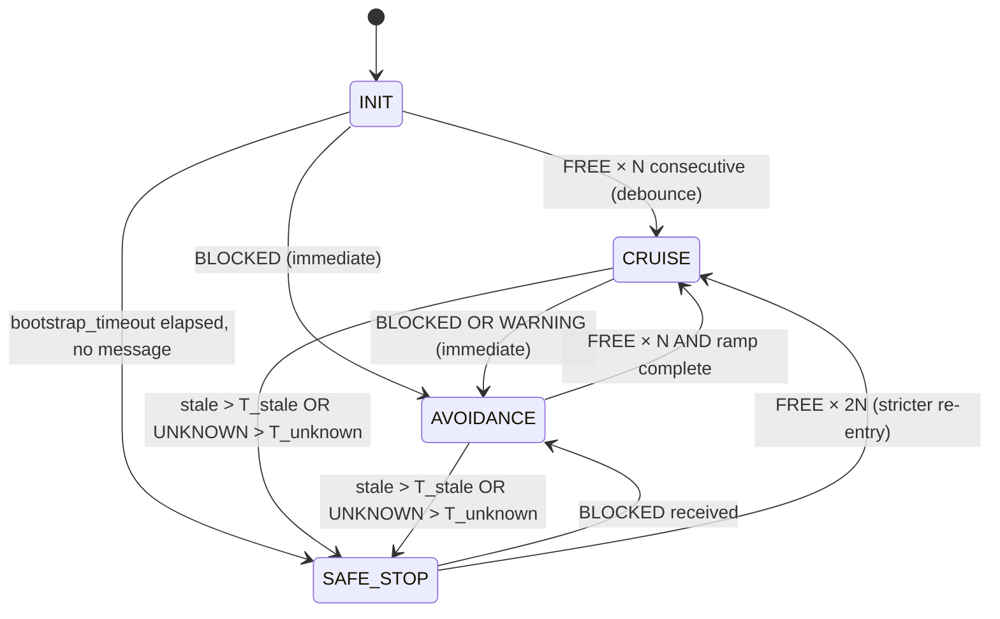

# Corridor-Aware Local Controller — Design

- **Date**: 2026-05-09
- **Status**: Draft, awaiting user review
- **Authors**: Claude (synthesizing 5-agent design team — architect ×2, ros2-architect, code-reviewer, test-engineer)
- **Workspace**: `/home/amap/Study/ros2_3dslam_ws`
- **Target**: ROS2 Humble + Nav2 (Smac Hybrid-A* + RPP), Ignition Gazebo Fortress

---

## 1. Motivation

The current Nav2 stack runs the local controller (`controller_server` with RPP plugin) and `local_costmap` continuously at fixed rates regardless of corridor situation:

- `controller_frequency: 20 Hz` — RPP evaluation + collision check, every 50 ms.
- `local_costmap`: `update_frequency: 5 Hz` (voxel_layer LiDAR raycasting), `publish_frequency: 2 Hz`.

Within structured corridors (defined by the ODD route graph) and during periods when the corridor is unobstructed, this is wasted work. The user has already implemented the upstream pieces:

1. `route_graph_builder` → corridor topology
2. `odd_global_planner` → `/global_path` over the graph
3. `odd_costmap_generator` (global) → corridor occupancy
4. `local_odd_generator` → ODD attributes per path segment
5. `local_odd_costmap_generator` → `/odd_local_costmap` (local corridor mask)
6. `local_odd_obstacle_detector` → `/corridor_obstacle_status` (FREE / WARNING / BLOCKED / UNKNOWN, hysteresis-gated)

What's missing is the **glue** that lets Nav2 consume `/corridor_obstacle_status` to decide *when* to invoke the heavy local controller, and lets Nav2 consume `/odd_local_costmap` *as* its local costmap so duplicated LiDAR raycasting is eliminated.

### 1.1 Core principle — no trajectory generation

Both modes of this plugin (lightweight pursuit on FREE, RPP delegation on BLOCKED) consume the existing `/global_path` directly without re-generating any local trajectory. This is the core resource-saving lever — distinct from TEB / DWB / MPPI controllers which sample or optimize trajectories every tick. The plugin's only job is producing `cmd_vel` from an already-generated global path; trajectory generation belongs to the global side (`odd_global_planner` or Smac Hybrid-A*) and happens once per goal, not per tick.

## 2. Goals & Non-goals

**Goals**

- Activate full local-controller cost (RPP + costmap maintenance) only when the ODD detector reports BLOCKED / WARNING / UNKNOWN.
- Eliminate the duplicated LiDAR-driven `voxel_layer` in Nav2's `local_costmap`. The single source of truth for corridor obstacles is the ODD pipeline.
- Zero modification to the existing six ODD-Local packages.
- Zero Behavior Tree XML modification.
- Zero lifecycle-toggling supervisor node — switching happens inside a single `nav2_core::Controller` plugin.

**Non-goals (explicitly out of scope for this design)**

- Multi-robot namespacing of `/corridor_obstacle_status`. Single-robot scope only.
- Replacing RPP with MPPI/DWB/TEB. The wrapper composes RPP specifically.
- Modifying `local_odd_obstacle_detector` (e.g., adding a heartbeat). Stale-detection is handled controller-side.
- Tuning Smac Hybrid-A* (global planner). This design touches only the local layer.
- Multi-corridor / corridor-handoff arbitration. One active corridor at a time.

## 3. Architecture

### 3.1 Component overview

```
┌──────────────────────────────────────────────────────────────────┐
│                       Existing (unchanged)                        │
│                                                                   │
│  route_graph_builder ──► odd_global_planner ──► /global_path     │
│  /global_path        ──► local_odd_generator ──► LocalOddMap     │
│  LocalOddMap         ──► local_odd_costmap_generator             │
│                                          └──► /odd_local_costmap │
│  /odd_local_costmap + /scan_merged                                │
│                      ──► local_odd_obstacle_detector              │
│                                          └──► /corridor_obstacle_status
└──────────────────────────────────────────────────────────────────┘
                                                       │
                                                       ▼
┌──────────────────────────────────────────────────────────────────┐
│                            New (this design)                      │
│                                                                   │
│  controller_server (lifecycle node, 20 Hz control thread)         │
│   │                                                               │
│   ├── nav2_costmap_2d::Costmap2DROS  "local_costmap"              │
│   │     plugins: [odd_corridor_layer, inflation_layer]            │
│   │     ─ NEW: odd_costmap_layer::OddCorridorLayer                │
│   │            (subscribes /odd_local_costmap)                    │
│   │     ─ removed: voxel_layer                                    │
│   │                                                               │
│   └── FollowPath plugin = corridor_aware_controller::             │
│                            CorridorAwareController                │
│         ├── status sub: /corridor_obstacle_status                 │
│         ├── state machine: INIT/CRUISE/AVOIDANCE/SAFE_STOP        │
│         ├── lightweight pursuit (no costmap query)                      │
│         └── std::unique_ptr<RegulatedPurePursuitController> rpp_  │
│                            (eager configure+activate)             │
└──────────────────────────────────────────────────────────────────┘
```

### 3.2 Data flow per control tick (20 Hz)

```
controller_server tick (50 ms cadence)
  │
  ├─ pose lookup ────────────────────────────────────► (provided to plugin)
  │
  └─ CorridorAwareController::computeVelocityCommands()
       │
       ├─ read latest corridor_obstacle_status (atomic + mutex'd timestamp)
       ├─ check stale (now - stamp > status_stale_timeout?) → force AVOIDANCE
       ├─ run state machine → branch: LIGHTWEIGHT / RPP / SAFE_STOP
       │
       ├─ LIGHTWEIGHT branch:
       │    ├─ transform global_plan_ into pose.frame if needed
       │    ├─ pure-pursuit lookahead on plan
       │    ├─ corridor footprint check via local_costmap (free, since
       │    │   odd_corridor_layer is the only obstacle source — same data
       │    │   that detector already evaluated; lightweight consistency check)
       │    └─ return TwistStamped
       │
       ├─ RPP branch:
       │    └─ rpp_->computeVelocityCommands(pose, vel, goal_checker)
       │         (RPP reads same local_costmap, now corridor-mask only)
       │
       └─ SAFE_STOP branch:
            └─ ramp-decel toward zero velocity (max_decel honored)
```

### 3.3 State machine



**Asymmetric debounce**: tightening (toward AVOIDANCE) is immediate; loosening (back to CRUISE) requires `N` consecutive FREE messages. Safety beats smoothness.

**INIT output behavior**: while INIT is active (waiting for the first decisive status message), the plugin delegates `computeVelocityCommands` to RPP. RPP's own collision detection bounds the risk while we await ground truth from the detector. If `bootstrap_timeout` elapses without any message, the state machine transitions to SAFE_STOP and the output becomes a decel ramp toward zero — not RPP delegation.

## 4. Design decisions

### D-1. Composition wrapping RPP, not subclassing
The plugin holds `std::unique_ptr<RegulatedPurePursuitController> rpp_`. Subclassing was rejected because RPP's protected members and dynamic-parameter handler assume self-management. Composition keeps lifecycle isolation clean.

### D-2. WARNING is treated as AVOIDANCE by default
WARNING is the detector's "something is approaching the corridor edge" signal. Lightweight pursuit has no collision check; it is unsafe to drive on WARNING with lightweight pursuit. Parameterized as `warning_delegates_to_rpp` (default `true`) so a future tuning pass can revisit.

### D-3. ODD costmap replaces voxel_layer (Scenario C)
Rationale: the user's original framing — "create ODD from global planner, check obstacles inside this ODD" — implies a single source of truth. Running both `voxel_layer` (LiDAR raycasting in Nav2) and `local_odd_obstacle_detector` (LiDAR vs corridor mask) is double work. By making the local_costmap consume `/odd_local_costmap` directly via a new layer plugin, the obstacle definition is unified and the heavier of the two raycasters disappears.

### D-4. Eager RPP lifecycle cascade
`configure → activate` of RPP happens at controller_server startup, not lazily on first AVOIDANCE entry. Lazy activation would advertise topics mid-control-loop, miss parameter callbacks, and risk a zero/invalid first cmd_vel. RPP stands always-armed, even when not currently invoked.

### D-5. Stale status forces AVOIDANCE, never CRUISE
"No new message for > `status_stale_timeout` (default 0.3 s = 6 ticks at 20 Hz publish)" → controller switches to AVOIDANCE. Absence of evidence is not evidence of clear corridor. (See Reviewer CRITICAL-3.)

### D-6. New launch coexists with the existing one
`nav2_full_bringup.launch.py` is preserved unchanged for A/B regression comparison. The new entry point is `nav2_odd_aware_bringup.launch.py`, which co-launches the ODD detector as a hard runtime dependency.

## 5. New package #1 — `corridor_aware_controller`

**Location**: `src/Planner/Nav2/corridor_aware_controller/`

**Build**: `ament_cmake`, exports `nav2_core` plugin.

**Class**: `corridor_aware_controller::CorridorAwareController : public nav2_core::Controller`

### 5.1 Members (logical groups)

| Group | Purpose |
|---|---|
| Lifecycle handles | `LifecycleNode::WeakPtr`, plugin name, logger, clock |
| Nav2 plumbing | `tf2_ros::Buffer`, `Costmap2DROS` shared_ptrs (passed in by `controller_server`) |
| Wrapped RPP | `std::unique_ptr<RegulatedPurePursuitController> rpp_` |
| Status | `Subscription<CorridorObstacleStatus>::SharedPtr`, `std::mutex`, `std::optional<msg::CorridorObstacleStatus>`, `rclcpp::Time last_status_stamp_` |
| State machine | `enum class Mode {INIT, CRUISE, AVOIDANCE, SAFE_STOP}`, free-debounce counter, last-mode, last-cmd_vel for ramp |
| Lightweight pursuit | `nav_msgs::msg::Path global_plan_`, lookahead params, last-carrot-index cursor |
| Diagnostics | optional `LifecyclePublisher<std_msgs::msg::UInt8>` for `/odd_aware_controller/active_mode` |
| Plugin params | timeout, debounce counts, lookahead settings, `warning_delegates_to_rpp`, `enable_debug_topics` |

### 5.2 Method contracts

| Override | Behavior |
|---|---|
| `configure(parent, name, tf, costmap_ros)` | Cache handles, declare params under `name.*`, construct `rpp_` and call `rpp_->configure(parent, name, tf, costmap_ros)` (RPP reads existing `FollowPath.*` params), create status subscription on a **Reentrant** callback group, create diagnostic publisher (latched). |
| `activate()` | `rpp_->activate()`. Activate diagnostic publisher. Enter `INIT` state. |
| `deactivate()` | Publish one zero-velocity cmd_vel. `rpp_->deactivate()`. Deactivate diagnostic publisher. |
| `cleanup()` | `rpp_->cleanup()`, `rpp_.reset()`, drop subscription/publisher. |
| `setPlan(path)` | Cache `global_plan_`, reset carrot cursor, `rpp_->setPlan(path)`. |
| `setSpeedLimit(speed, pct)` | Store locally for lightweight branch; forward to `rpp_->setSpeedLimit(...)`. |
| `computeVelocityCommands(pose, vel, goal_checker)` | Run state machine → branch to lightweight pursuit / RPP delegation / safe-stop ramp. See §3.2. |

### 5.3 Parameters (declared by plugin under `FollowPath.*`)

All RPP parameters from the existing `smac_hybrid_params.yaml` remain under the same namespace (the wrapped RPP consumes them). The plugin adds:

| Name | Type | Default | Description |
|---|---|---|---|
| `lightweight.lookahead_dist` | double | 0.6 | Pure-pursuit lookahead in CRUISE mode (m) |
| `lightweight.min_lookahead_dist` | double | 0.3 | Floor for adaptive scaling |
| `lightweight.max_lookahead_dist` | double | 1.2 | Ceiling for adaptive scaling |
| `lightweight.desired_linear_vel` | double | 0.5 | Forward speed in CRUISE (m/s) |
| `status_topic` | string | `/corridor_obstacle_status` | Override-able for namespacing |
| `status_stale_timeout` | double | 0.3 | Seconds; beyond this, treat as UNKNOWN |
| `bootstrap_timeout` | double | 1.0 | Seconds at INIT before SAFE_STOP if no message |
| `free_debounce_count` | int | 5 | Consecutive FREE samples to relax to CRUISE |
| `unknown_stop_timeout` | double | 0.5 | UNKNOWN duration before SAFE_STOP |
| `warning_delegates_to_rpp` | bool | true | If true, WARNING → RPP |
| `mode_switch_ramp_time` | double | 0.4 | AVOIDANCE→CRUISE blend window (seconds) |
| `safe_stop_decel` | double | 0.8 | m/s² in SAFE_STOP ramp |
| `enable_debug_topics` | bool | false | Gates diagnostic publishers |

### 5.4 Plugin XML registration

```xml
<class_libraries>
  <library path="corridor_aware_controller">
    <class type="corridor_aware_controller::CorridorAwareController"
           base_class_type="nav2_core::Controller">
      <description>
        Corridor-status-aware controller wrapping RPP. FREE: lightweight pursuit.
        BLOCKED/UNKNOWN/WARNING: delegate to RPP.
      </description>
    </class>
  </library>
</class_libraries>
```

`package.xml` exports `<nav2_core plugin="${prefix}/corridor_aware_controller_plugin.xml" />`.

## 6. New package #2 — `odd_costmap_layer`

**Location**: `src/Planner/Nav2/odd_costmap_layer/`

**Build**: `ament_cmake`, exports `nav2_costmap_2d` layer plugin.

**Class**: `odd_costmap_layer::OddCorridorLayer : public nav2_costmap_2d::Layer`

### 6.1 Responsibility

Subscribes `/odd_local_costmap` (OccupancyGrid). On each `updateCosts()` call by the costmap update thread (5 Hz), copies the latest mask into the master grid, applying:

- corridor cells (free in `/odd_local_costmap`) → `FREE_SPACE`
- non-corridor / obstacle cells → `LETHAL_OBSTACLE`
- unknown → `NO_INFORMATION` (configurable: treat as lethal or as free)

`inflation_layer` downstream applies the same `inflation_radius: 0.55` as before.

### 6.2 Parameters (declared under `local_costmap.local_costmap.odd_corridor_layer.*`)

| Name | Type | Default | Description |
|---|---|---|---|
| `topic` | string | `/odd_local_costmap` | Source topic |
| `unknown_treatment` | string | `lethal` | `lethal` / `free` / `noinfo` |
| `enabled` | bool | true | Standard Nav2 layer enable |

### 6.3 Plugin XML registration

`odd_costmap_layer_plugin.xml` exports `OddCorridorLayer` with `base_class_type="nav2_costmap_2d::Layer"`.

`package.xml` exports `<nav2_costmap_2d plugin="${prefix}/odd_costmap_layer_plugin.xml" />`.

## 7. Configuration changes

New file: `src/Planner/Nav2/nav2_smac_hybrid/config/smac_hybrid_odd_aware_params.yaml`. Diff against `smac_hybrid_params.yaml`:

```yaml
controller_server:
  ros__parameters:
    controller_plugins: ["FollowPath"]
    FollowPath:
      plugin: "corridor_aware_controller::CorridorAwareController"
      # Lightweight-pursuit parameters
      lightweight.lookahead_dist: 0.6
      lightweight.min_lookahead_dist: 0.3
      lightweight.max_lookahead_dist: 1.2
      lightweight.desired_linear_vel: 0.5
      # State machine
      status_topic: "/corridor_obstacle_status"
      status_stale_timeout: 0.3
      bootstrap_timeout: 1.0
      free_debounce_count: 5
      unknown_stop_timeout: 0.5
      warning_delegates_to_rpp: true
      mode_switch_ramp_time: 0.4
      safe_stop_decel: 0.8
      enable_debug_topics: false
      # ─── all existing RPP params below remain unchanged ───
      desired_linear_vel: 0.5
      lookahead_dist: 0.6
      # ... (rest of RPP parameters as in current file)

local_costmap:
  local_costmap:
    ros__parameters:
      update_frequency: 5.0
      publish_frequency: 2.0
      global_frame: odom_rtabmap
      robot_base_frame: base_link
      use_sim_time: true
      rolling_window: true
      width: 6
      height: 6
      resolution: 0.05
      robot_radius: 0.22
      plugins: ["odd_corridor_layer", "inflation_layer"]   # voxel_layer removed
      odd_corridor_layer:
        plugin: "odd_costmap_layer::OddCorridorLayer"
        topic: /odd_local_costmap
        unknown_treatment: lethal
        enabled: true
      inflation_layer:
        plugin: "nav2_costmap_2d::InflationLayer"
        cost_scaling_factor: 3.0
        inflation_radius: 0.55
      always_send_full_costmap: true
```

`global_costmap` and `planner_server` sections are unchanged (Smac Hybrid-A* still uses `/rtabmap/map` static layer).

## 8. Launch composition

New file: `src/Nav2/nav2_bringup_3dslam/launch/nav2_odd_aware_bringup.launch.py`.

Composition:

| Action | Source |
|---|---|
| `*setup_gpu_offload()` | `launch_utils` (project convention) |
| Include `tm_gazebo/launch/gazebo.launch.py` | `odom_tf:=false` |
| Include `rtab_map_3d/launch/localization/rtabmap_3dlidar_only_localization_gazebo.launch.py` | `rviz:=false` |
| Include `local_odd_generator/launch/local_odd_test.launch.py` | provides `/odd_local_costmap` |
| Include `local_odd_obstacle_detector/launch/local_odd_obstacle_detector.launch.py` | provides `/corridor_obstacle_status` |
| Include `nav2_smac_hybrid/launch/smac_hybrid_planner.launch.py` | with `params_file:=smac_hybrid_odd_aware_params.yaml` |
| RViz2 (optional, IfCondition `rviz`) | new layout showing `/active_mode` text and `/odd_local_costmap` |

The original `nav2_full_bringup.launch.py` is preserved verbatim as the regression baseline.

## 9. Safety invariants (non-negotiable)

These follow from the Reviewer's CRITICAL findings and must be present in implementation and in tests:

1. **SI-1** — `corridor_obstacle_status` cache is concurrency-safe. Read in 20 Hz control thread, written by the Reentrant subscription callback. Implementation MUST use `std::atomic<uint8_t>` for status + `std::atomic<uint64_t>` ns timestamp, OR a `std::mutex`-guarded struct held only for ns-scale copies. Torn reads are forbidden.

2. **SI-2** — RPP lifecycle is cascaded eagerly. Wrapper's `configure → configure rpp_`. Wrapper's `activate → activate rpp_`. Lazy activation on first BLOCKED is forbidden.

3. **SI-3** — Stale status forces AVOIDANCE. `now - last_status_stamp > status_stale_timeout` ⟹ `Mode::AVOIDANCE`. Never CRUISE on stale data.

4. **SI-4** — TF lookup failure outputs zero velocity, not last command. Stale TF is more dangerous than stopping.

5. **SI-5** — Plugin `deactivate()` publishes one zero `cmd_vel` before returning. Lifecycle transitions never leave a stale velocity command on the wire.

6. **SI-6** — Pose frame is honored as supplied by `controller_server`. The plugin MUST transform `global_plan_` into the pose's frame (typically `odom_rtabmap`), not invent a TF lookup.

7. **SI-7** — On `unknown_treatment: lethal` in the costmap layer (default), unknown-region cells are non-traversable for RPP. This makes corridor-leaving impossible by design.

## 10. Verification strategy

### 10.1 Unit tests (≈65% of effort) — `corridor_aware_controller`

Mocks: `Costmap2DROS`, status subscriber driver, mock `RegulatedPurePursuitController` recording call counts.

| ID | Scenario | Expected |
|---|---|---|
| U-01 | cold boot, no status received, t < bootstrap_timeout | mode=INIT, output delegated to RPP |
| U-01b | cold boot, no status received, t ≥ bootstrap_timeout | mode=SAFE_STOP, decel ramp toward zero |
| U-02 | status=FREE, debounced | mode=CRUISE, lightweight pursuit, RPP delegate count=0 |
| U-03 | status=BLOCKED | mode=AVOIDANCE, RPP delegate count=1 |
| U-04 | status=UNKNOWN brief (<unknown_stop_timeout) | mode=AVOIDANCE (delegate to RPP) |
| U-05 | status=UNKNOWN ≥ unknown_stop_timeout | mode=SAFE_STOP, decel ramp |
| U-06 | FREE→BLOCKED transition | mode switches on first BLOCKED tick |
| U-07 | BLOCKED→FREE transition | requires `free_debounce_count` consecutive FREE |
| U-08 | Stale status (no msg > status_stale_timeout) | mode=AVOIDANCE |
| U-09 | empty global plan | zero velocity, no exception |
| U-10 | goal reached (last point in plan) | zero velocity |
| U-11 | WARNING with default `warning_delegates_to_rpp=true` | mode=AVOIDANCE |
| U-12 | WARNING with `warning_delegates_to_rpp=false` | mode=CRUISE (lightweight) |
| U-13 | mode-switch ramp (AVOIDANCE→CRUISE) | linear cmd_vel blend over `mode_switch_ramp_time` |
| U-14 | concurrent status writes during compute | no torn read (TSan / repeated stress) |

### 10.2 Unit tests — `odd_costmap_layer`

| ID | Scenario | Expected |
|---|---|---|
| L-01 | corridor mask published | `updateCosts` writes FREE inside, LETHAL outside |
| L-02 | unknown_treatment=lethal | unknown cells → LETHAL |
| L-03 | unknown_treatment=free | unknown cells → FREE_SPACE |
| L-04 | topic stale (no message yet) | layer reports `current=false`, master grid keeps prior values |
| L-05 | grid resolution mismatch | warn, use nearest-neighbor copy |

### 10.3 Integration tests (≈25%)

Spin `controller_server` with new plugin via `launch_testing`. No Gazebo. Pump synthetic plan + status + scan-equivalent costmap message.

| ID | Scenario | Expected |
|---|---|---|
| I-01 | FREE held 10 s | `/cmd_vel_nav` continuous, mean ≥ 0.4 m/s |
| I-02 | FREE→BLOCKED at t=5 s | no cmd_vel gap > 100 ms |
| I-03 | status publisher killed | within `status_stale_timeout`, RPP takes over |
| I-04 | empty plan injected | no crash, error log |
| I-05 | BLOCKED throughout | cmd_vel matches reference RPP-only run within tolerance |

### 10.4 SIL / Gazebo end-to-end (≈10%)

Uses pioneer2dx + RTAB-Map 3D + `nav2_odd_aware_bringup.launch.py`. Captures via `experiments/run_*` shell scaffold + `capture_step()` skill.

| ID | Scenario | Success criterion |
|---|---|---|
| S-01 | Long corridor, unobstructed | Goal reached; CRUISE mode published > 80% of run |
| S-02 | Dynamic obstacle injected mid-run | AVOIDANCE engages within 200 ms; resumes CRUISE after clearance + debounce |
| S-03 | Detector node killed at t=5 s | SI-3 takes effect: AVOIDANCE remains; recovers when detector restarts |
| S-04 | RPP-only baseline run (existing `nav2_full_bringup`) | Establishes cmd_vel + CPU baseline |
| S-05 | Mixed corridor with 3× FREE↔BLOCKED transitions | Path tracking error ≤ 0.3 m vs global plan |

### 10.5 Resource benchmark

- Tooling: `top -b -d 1 -p $(pgrep controller_server)` for 60 s steady-state, plus `perf stat -p <pid> -e cycles,instructions` for 30 s.
- Baseline: S-04 (existing stack).
- Target: S-01 (CRUISE most of the time) shows `controller_server` CPU% ≤ **70%** of baseline.
- The voxel_layer removal portion is measured separately by comparing S-04 vs. an interim build that has only the layer change (no plugin change).

### 10.6 Regression guards (must still pass)

- `local_odd_obstacle_detector` existing unit tests (interface preserved).
- `experiments/run_forward_align_test.sh` baseline.
- `nav2_full_bringup.launch.py` end-to-end (unchanged path).

## 11. Backward compatibility

- `nav2_full_bringup.launch.py` and existing `smac_hybrid_params.yaml` are untouched. Operators without ODD detector running continue to use the original entry point with no change.
- If the new entry point is launched but the ODD detector is not running (operator error), `corridor_aware_controller` enters `INIT`, exhausts `bootstrap_timeout`, and transitions to `SAFE_STOP`. A throttled `RCLCPP_WARN` (every 10 s) names `/corridor_obstacle_status` as the missing topic.
- The new entry point depends on existing ODD-Local packages; they are unmodified.

## 12. Open questions (deferred / for review)

1. **Detector heartbeat**: would a fixed-rate (e.g., 20 Hz) heartbeat from `local_odd_obstacle_detector` simplify staleness detection? Out of scope for this design (would touch the detector). If desired, a follow-up issue can add it; today's `status_stale_timeout` covers the same ground from the consumer side.
2. **`unknown_treatment` default**: this design picks `lethal` for safety. If field experience shows excessive false-stops in regions with sparse ODD coverage, revisit to `noinfo` and document.
3. **Pluginlib for delegate**: the current design hard-links RPP. A future change could allow `delegate_plugin_name` to load any `nav2_core::Controller` via pluginlib (MPPI, DWB). Deferred — not needed for first integration.

## 13. Acceptance

This design is accepted when:

- All seven safety invariants (§9) are present in code and verified by tests.
- Unit + integration test suites in §10.1–§10.3 pass at 100%.
- SIL S-01 through S-05 (§10.4) pass success criteria.
- Resource benchmark (§10.5) meets the ≤ 70% baseline target.
- `nav2_full_bringup.launch.py` regression (§10.6) passes unchanged.

---

**Next step after approval**: invoke `superpowers:writing-plans` to break this design into an executable implementation plan.
