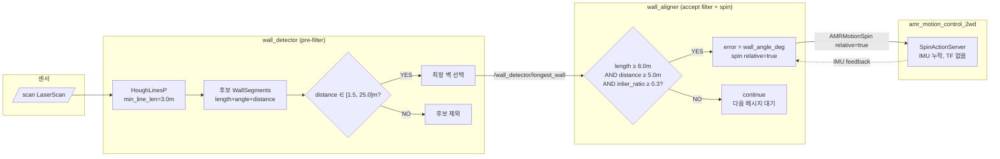
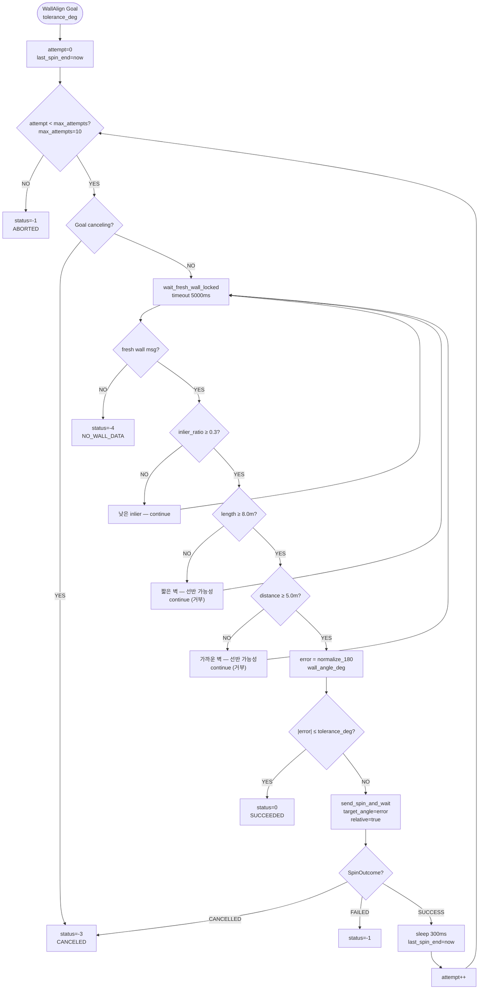
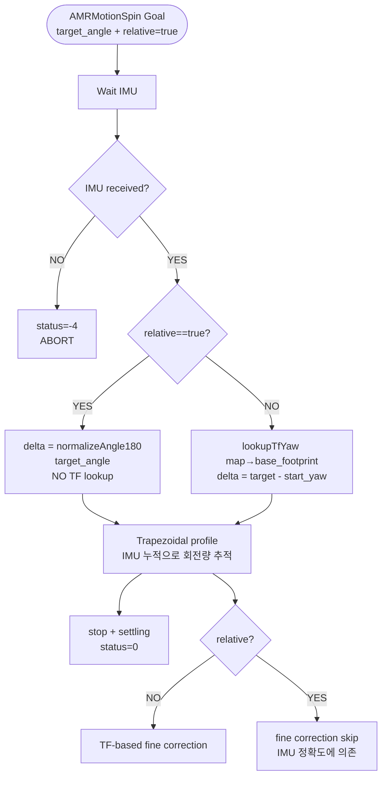

# Wall Align Pipeline — Filter/Rotation Flow

> TF-free (map·odom 불필요) · IMU 상대회전 · bag 근거 기반 필터 (N=1461)

## 1. 전체 파이프라인

## 2. wall_aligner execute 루프 상세

## 3. SpinActionServer relative 모드 (TF-free)

## 4. 필터 임계 근거 (bag 분석 N=1461)

| length_m | distance_m | 샘플 수 | 비율 | 해석 |
|---|---|---:|---:|---|
| ≥11m | ≥10m | 469 | 32.1% | **외벽 (정렬 대상)** |
| ≥11m | 3~6m | 44 | 3.0% | 외벽 근접 |
| 5~9m | 6~10m | 641 | 43.9% | 내부 구조/선반 → **거부** |
| 5~9m | <6m | 82 | 5.6% | 내부 구조 근접 → **거부** |
| <5m | any | 71 | 4.9% | 단일 선반 행/노이즈 → **거부** |

`min_wall_length_m=8.0` + `min_wall_distance_m=5.0` 는 외벽 그룹(약 35%)만 통과.

## 5. 필터 전/후 동작 요약

| 시나리오 | 위치 | 필터 전 (오동작) | 필터 후 (정상) |
|---|---|---|---|
| S1 | 스폰 | 11.15m 외벽 정렬 ✓ | 11.15m 외벽 정렬 ✓ |
| S2 | (-10, 0, 45°) | 7.9m 내부벽 오정렬 | **8.75m 외벽 정렬** |
| S3 | (-5, 3, 90°) | 5.2m 선반 오정렬 | **ABORT** (외벽 없음 — 의도) |
| S4 | (0, 0, 30°) | 5.8m 선반 오정렬 | **ABORT** (외벽 없음 — 의도) |

## 6. 의존성 제거 요약

| 제거된 의존 | 이유 |
|---|---|
| `tf_buffer_` / `tf_listener_` (wall_aligner) | 회전량은 lidar frame 그대로 사용 |
| `reference_frame` / `robot_frame` 파라미터 | TF lookup 불필요 |
| `get_robot_yaw_deg()` 함수 | absolute yaw 왕복 경로 제거 |
| `world_wall_lock` 로직 | TF 의존 동일 벽 추적 불필요 |
| `map → base_footprint` lookup (spin_action_server) | relative 모드에서 skip |

이로써 **SLAM 미기동 상태 / map frame 없는 상태 / 어느 reference_frame 이든** 독립적으로 동작.
